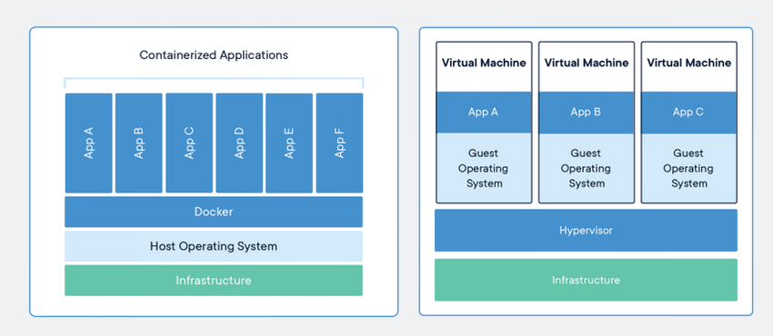
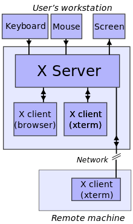
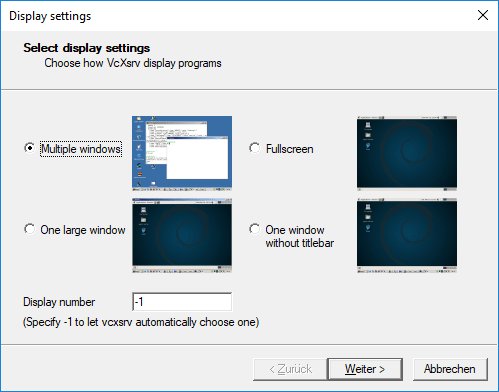
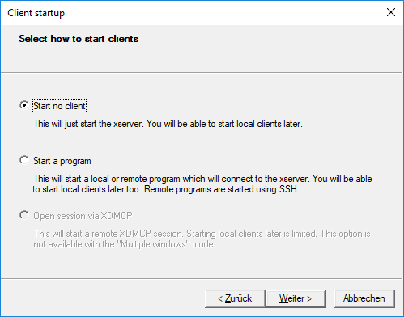
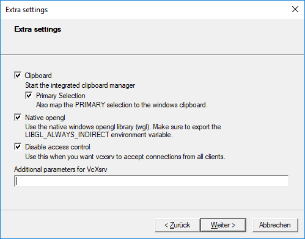
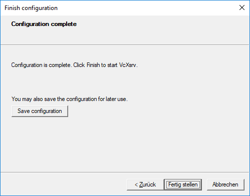

# Docker GUI

Docker is normally used as a containerisation tool for background applications and CLI programs. However, as Kasm demonstrates, it is also possible to run GUI applications from Docker containers. We should know this intuitively as when we develop our applications within Docker we actually do this all the time. We can however borrow an existing X Server implementation where the host is already running it's graphical environment.

It is important to first understand what Docker is doing for us. Docker is encapsulating our program, it is running the program in an isolated environment, but unlike a virtual machine, it is only running what we need, operating on the same kernel as the host system. The below graphic demonstrates the difference between containers abd VMS. Containers build up layered images, once built, only the parts that change must be rebuilt, we also only host that which we need, we do not run an entire OS unlike when we run a VM.



From this knowledge we can deduce that since our container has access to our host system, and already uses part of our system, then we should theoretically be able to do whatever we can on our host system within a container. This means, we should be able to access the X Server and X Window system. X Window System is the next component we will discuss.

## X Window System

The X Window system is a windowing system for bitmap displays, common on unix-like OS. X provides a basic framework for a GUI environment, such as rendering, drawing, moving windows etc... X does not however mandate the UI itself, this is controlled on a per application basis.

X Provides an architecture-independent system for remote GUIs. It provides a basic framework for primitives, for building GUI environments, and interacting with displays and peripherals.

X uses a client-server model. The X Server itself communicates with various client programs, the server accepts requests for graphical input and output, and returns user input from peripherals. X is from the perspective of the application, not that of the user, providing a display and I/O services to applications, thus the client-server terminology. X is a server,of which applications use these provided services, thus they are clients.



An example of an X Server would be [Xorg](https://www.x.org/wiki/) but for Windows users you may be more familiar with [Xming](http://www.straightrunning.com/XmingNotes/).

The point here that you should take away, if nothing else, is that X Servers provide the fundamental graphical capabilities to our system. Without the X Server GUI applications cannot render, in order to use graphical interfaces within our Docker containers, we must make sure our containers can access our hosts X Server. Doing so is theoretically possible, but rarely used, Docker must be running in privileged mode for this to enable it to have access to the hosts hardware, starting the server would attempt to lay claim to the video devices, which results in the lost of video output as our hosts original X Server gets has its devices removed. Instead, as alluded to previously, we can mount our hosts X Server within our containers, allowing Docker to have access to the X Server we already have. GUI applications we run in this case will appear on our existing desktop.

## Benefits Of Containerisation

So after reading through this you may be thinking: "great, so with all this trouble I can run GUI software on my docker containers... but is it really worth the trouble?" and the answer to that question, it is really up to you. You could run and install software locally on your machine, however, this often pollutes your machine with packages and software that you may later wish to remove, especially had you only been evaluating or using that software for a single task. Instead, by running our applications in Docker containers we make them easy to spin up and destroy as and when we please. Please note that the container will get access to your hardware information via X Socket, this is necessary for running GUI applications and does forgoe some of the security associated with containerisation, however, it is still better than running software on our local machine. Remember, we are running in privileged mode which makes us a bit more vulnerable, and are sharing more of our local machines information, this means that if we are running on an external server, we also want to put in place some additional security practices to ensure we are operating as securely as we can. We can even evaluate the security of containers using [Docker Bench Security](https://github.com/docker/docker-bench-security).

## Forwarding X Socket to Docker

Providing a Docker container with access to the hosts X socket is not as complex of a procedure as it sounds, though there are additional steps for doing so on a windows host.
To begin with we will take a look at the Linux method.

### Linux

To begin we must first locate X Socket on our host, for any Linux system this should exist within out temporary folder: ````/tmp/.X11-unix````

This is the directory, the contents of which, we wish to mount into our Docker volume assigned to the container. We must use the hosts networking mode for this, this means that our Docker network will share our [host network](https://docs.docker.com/network/host/) and we lose some of the isolation we usually attain with containers.

We must also provide a Display value to our environment variables within the Docker container to instruct the X Clients on which X Server thy are connecting to.

<details open>
<summary>docker-compose.yml</summary>
<pre>
<code>
version: "3.8"

services:
  xsocket:
    image: xsocket:latest
    build: .
    environment:
      - DISPLAY=${DISPLAY}
    volumes:
      - /tmp/.X11-unix:/tmp/.X11-unix
    network_mode: host
</code>
</pre>
</details>

Then we need a Dockerfile to run our chosen application.

<details open>
<summary>Dockerfile</summary>
<pre>
<code>
FROM ubuntu:latest
RUN apt-get update && apt-get install -y firefox
CMD ["/usr/bin/firefox"]
</code>
</pre>
</details>

We should then be able to build and run the image in the usual manner: ````docker-compose up --build -d````.

Once the container is built you should have a instance of firefox running on your system.

<pre>
Important Note: Please remember that sharing your X Server to a Docker container is indeed a security risk. Make sure you only do this with containers you trust.
</pre>

To Access X Server you may need to authenticate the container and grant it access. We can generate a token with the command: ```xauth list```

Within the container we must then install the Xauth package, we can gain access to our container using the ```docker exec -ti``` command.

<pre>
<code>
apt install -y xauth
xauth add <token>
</code>
</pre>

This should authenticate your container to use X Server.

### Windows

Using Windows we have a slightly harder time. There are many tutorials on sharing out GUI on Linux hosts due to the large community surrounding Linux, Windows, however popular it may be, does not, this may be due to the fact that Windows is not Open Source and therefore locks out a lot of it's content to the System user, however, here we will take some additional steps to make executing our GUI applications within Docker containers possible.

First of all, we need an X Server, in this example I will use VcXsrv, simply because this is what I initially learned to use, but you can use any [alternative](https://www.saashub.com/compare-xming-vs-vcxsrv) you wish including XMing which tends to be more popular.

Instead of installing this manually, we will do so via the [chocolatey](https://chocolatey.org/) package manager for windows.

<pre>
<code>
choco install vcxsrv
</code>
</pre>

This should add an XLaunch application to the start menu. Run through the configuration process being sure to save your config before finishing to one of the following locations:

- %appdata%\Xming
- %userprofile%\Desktop
- %userprofile%

<details open>
<summary>XLaunch Configuration</summary>

1. 
2. 
3. 
5. 

</details>

Next we need to create our Dockerfile.

<details open>
<summary>Dockerfile</summary>
<pre>
<code>
FROM ubuntu:14.04
RUN apt-get update && apt-get install -y firefox
CMD /usr/bin/firefox
</code>
</pre>
</details>

this will build a container with a given application installed, in this case firefox, but we could install any GUI application we want.

We can than either use commands to build this container manually, or automate this with a docker-compose file.

<details open>
<summary>docker-compose.yml</summary>
<pre>
<code>
version: "3.8"

services:
  xsocket:
    build:
      context: .
      dockerfile: Dockerfile
    environment:
      - DISPLAY=${DISPLAY}
    volumes:
      - /tmp/.X11-unix:/tmp/.X11-unix
    network_mode: host
</code>
</pre>
</details>

If you simply want the quick commands for this.

We first need to build the container and label it.

<pre>
<code>
docker build -t firefox .
</code>
</pre>

set the environment variable for DISPLAY replacing the IP address with your own:

<pre>
<code>
set-variable -name DISPLAY -value {IP}:0.0
</code>
</pre>

We can then run the container:

<pre>
<code>
docker run -ti --rm -e DISPLAY=$DISPLAY firefox
</code>
</pre>

If you want your container to persist data you will need to find all the locations where the specific application stores data and mount these as volumes to the container.

### VNC Server

An alternative to this is to use a VNC server. This is the solution Kasm itself uses. To conclude, the preferred approach for most users is to likely utilise Kasm as a remote service. This is by far a more practiced and secure approach than we can configure plainly by ourselves. Due to it's large community and business usage Kasm will likely always have better security practices than we can implement ourselves, as fun as it is to play with these things, sometimes the simplest solution is best.


[<< Home](./README.md)