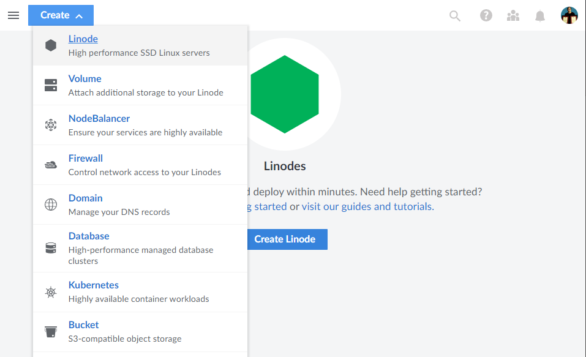
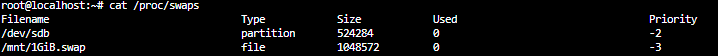

# Kasm - Remote Installation

Installing Kasm on a cloud service is one of the more popular options for personal use. This allows us to use a different IP address from our home IP when using the box, not only this, it also allows us to access our Kasm workspace from any simply by installing a browser extension.

## Prerequisites

You can install Kasm on any system which allows for the installation of software. This can be a remote server, or even your local machine, a VM or a docker container, it is entirely up to you, it matters not whether this is an Azure or AWS instance, the process is the same. For this example I will be installing Kasm on a remote Linode cloud server which I rent for it's affordability on the cost/performance tradeoff scale.

The resources required for running Kasm are stated as such on their
website:

### Resource Requirements

|   |   |
| --- | --- |
| __CPU__ | 2 Cores |
| __RAM__ | 4 GB |
| __Storage__ | 50GB (SSD) |

Anything over this is fine, however, remember the more cores you have the better your multitasking will be overall. For anything strenuous which requires multiple engines to run (graphical processing, scientific analysis, etc...) you may want to buy access to a machine with more CPU cores. In this case you may also wish to increase your RAM to improve performance running multiple applications. RAM is temporary memory storage which is accessed randomly for speed. For simple browsing 4GB should be plenty, but again, anything more strenuous and you may want to increase this.

### Installation

First of all, head to your preferred cloud provider and begin creation of your virtual hosted environment.



Select your preferred OS and configure your machines system requirements. You should however ensure that Kasm supports the OS version you are installing:

| Kasm - Supported OS  |
| --- |
| __Ubuntu 18.04 / 20.04 / 22.04 (amd64/arm64)__ |
| __Debian 9 / 10 / 11 (amd64/arm64)__ |
| __CentOS 7 / 8 (amd64/arm64)__ |
| __Oracle Linux 7 / 8 (amd64/arm64)__ |
| __Raspberry Pi OS (Debian) 10 / 11 (arm64)__ |
| [Other](https://kasmweb.com/docs/latest/how_to/other_operating_systems.html) |


#### Swap Partitions

<hr />

Once your server is running you can SSH into it. The first thing we will do then is create a Swap partition. This is a Linux concept, those of you unfamiliar with Linux will likely have never heard of this, it is simply a standard disk partition which has been designated as "Swap Space". Unlike Windows and Mac OS which run from a single partition Linux systems allow us to create an overflow space for RAM, if the RAM fills up completely any additional applications will run from the swap space rather than RAM. Swap partitions are not always desirable, for instance on a system with less than 1GB of RAM we would constantly be overflowing and using swap space. It is however a good idea to configure swap space in cases where you use resource heavy applications. Just remember, this is not the same as having "more RAM", though it allows RAM overflow SSD storage, even in it's modern form, is still far flower than RAM. Swap partitions are also necessary in Linux for using hibernation, it is recommended to always have some swap space for stability, incase faulty applications misuse RAM or any other incidents which may require a "buffer".

##### Creating A Swap Partition

To create a swap partition we run te following commands:

<pre>
<code>
sudo dd if=/dev/zero bs=1M count=1024 of=/mnt/1GiB.swap

sudo chmod 600 /mnt/1GiB.swap

sudo mkswap /mnt/1GiB.swap

sudo swapon /mnt/1GiB.swap
</code>
</pre>

The dd command is the primary utility for converting and copying files, where ````if```` represents the input file and ````of```` represents the output file. The options between these two options stands for blocksize, this is the number of bytes which are read/written at a time, count copies the number of block up to ```n``` where ````n```` is the defined input.

In this command we are essentially copying the input file ````/dev/zero```` over to the output file ````/mnt/1GIB.swap````.

We then change the permissions of the output file so that only the owner of the file has full read and write access. The CHMOD command follows the order of precendence: Owner (u), Group (g), Other (o) and lastly All (a).

We then create the swap partition from the swap file, and lastly turn on the swap partition.

<details open>
<summary>CHMOD Permissions table</summary>

| # | Sum | rwx | Permission |
| --- | --- | --- | --- |
| 7 | 4(r) + 2(w) + 1(x) | rwx | read, write and execute |
| 6 | 4(r) + 2(w) | rw- | read and write |
| 5 | 4(r) + 1(x) | r-x | read and execute |
| 4 | 4(r) | r-- | read only |
| 3 | 2(w) + 1(x) | -wx | write and execute |
| 2 | 2(w) | -w- | write only |
| 1 | 1(x) | --x | execute only |
| 0 | 0 | --- | none |

</details>

We can check our partition was created successfully using the ````cat```` command, this will output the contents of a file.



We then need to add the swap partition to ````ftab```` so that it mounts on boot or after a reboot.

<pre>
<code>
echo '/mnt/1GiB.swap swap swap defaults 0 0' | sudo tee -a /etc/fstab
</code>
</pre>

````ftab```` is Linux's filesystem table, it is a configuration table designed to ease the burden of mounting and unmounting file systems to a machine, it contains a set of rules used to control how different filesystems are treated each time they are introduced to a system.

<hr />

#### Installing Kasm

Next, we want to ```cd``` into our temporary location: ```cd /tmp```.

We can then download the Kasm setup via the ```wget``` command.

<pre>
<code>
wget https://kasm-static-content.s3.amazonaws.com/kasm_release_1.10.0.238225.tar.gz
</code>
</pre>


We must then unzip the contents of the tar file we downloaded.

<pre>
<code>
tar -xf kasm_release*.tar.gz
</code>
</pre>

Then it is simply the case of running the install script.

<pre>
<code>
sudo bash kasm_release/install.sh
</code>

Once installation is complete you should save your login credentials:

Kasm UI Login Credentials

------------------------------------
  username: admin@kasm.local
  password: ---------------
------------------------------------
  username: user@kasm.local
  password: ---------------
------------------------------------

Kasm Database Credentials
------------------------------------
  username: kasmapp
  password: ---------------
------------------------------------

Kasm Redis Credentials
------------------------------------
  password: ---------------
------------------------------------

Kasm Manager Token
------------------------------------
  password: ---------------
------------------------------------

</pre>

[<< Home](./README.md)